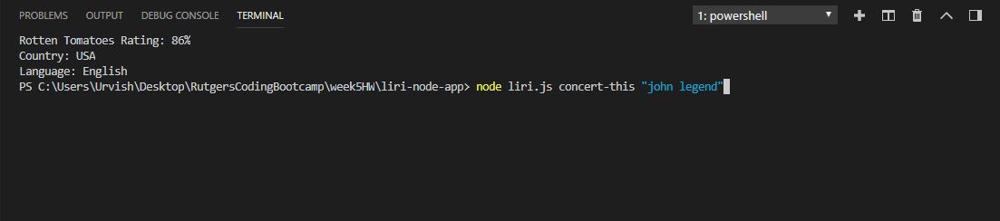
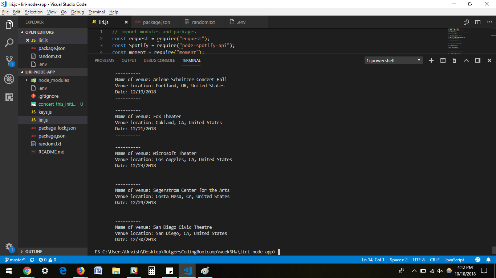
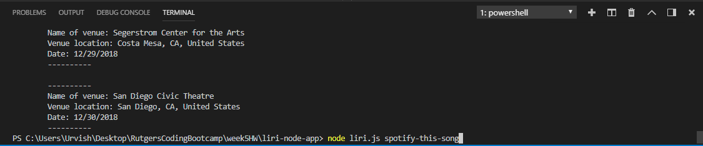
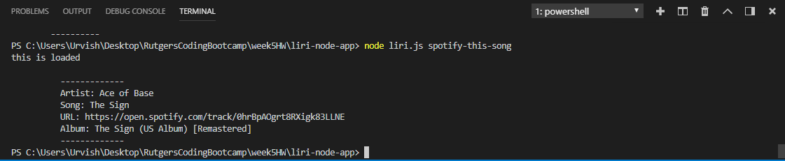
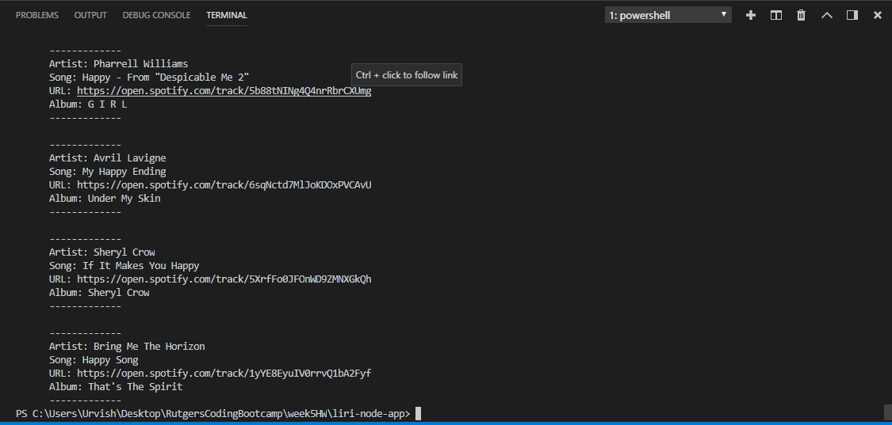
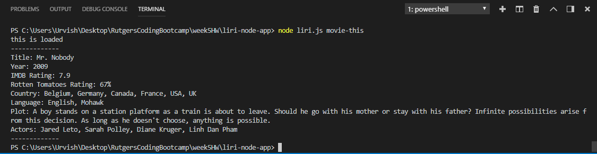
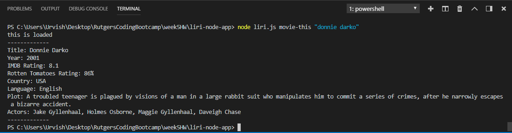
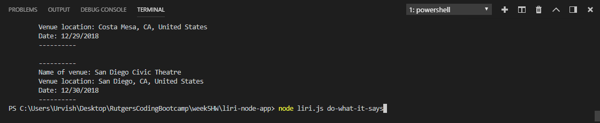
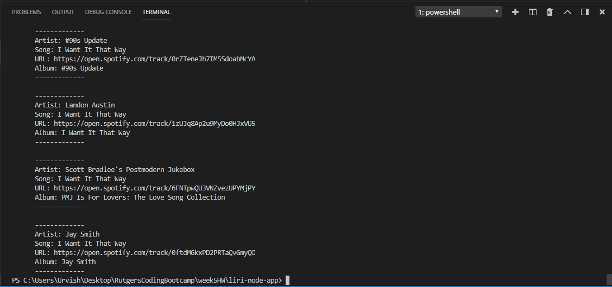

# Liri-Node-App

This app runs commands inputted through the command line and runs inputs put after the commands. For example, if "spotify-this-song" is a command, "happy" would be typed after it to search for a song named "happy." In the same light, "movie-this" is used to search for a movie, "concert-this" is used to search for concerts by a particular artist, and "do-what-it-says" is used to do what command is written in a .txt file.

1.  This image is of running "concert-this" with an input.

* This image shows the results of running that command.

2. This image shows inputting the "spotify-this-song" command.

* This image the results when "spotify-this-song" is ran without any inputs.

* This image shows the results when "spotify-this-song" is ran with an input of "happy."

3.  This image shows inputting the "movie-this" command with no input.

* This image shows running the "movie-this" command with a movie.

4. This image shows the initialization of "do-what-it-says"

* This image shows the result of running "do-what-it-says" with a "spotify-this-song" command and "I Want It That Way" input in a .txt file.

